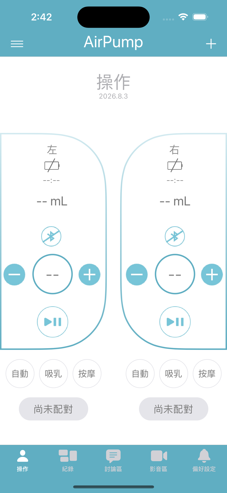
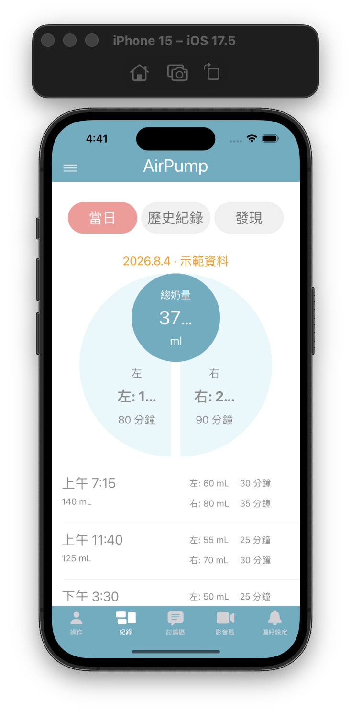
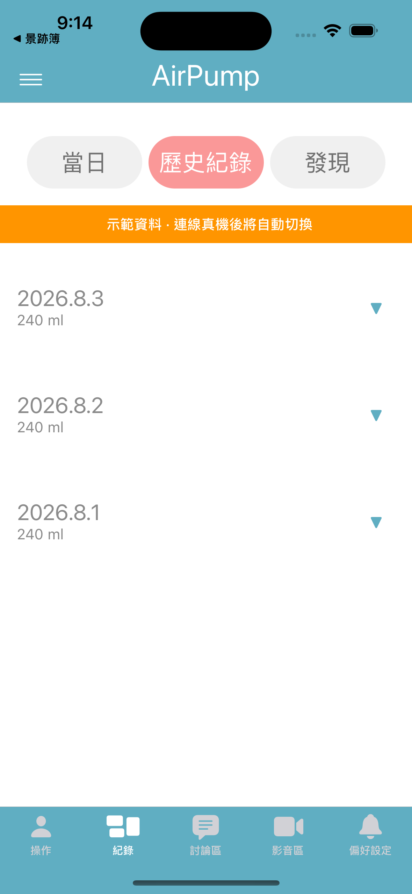
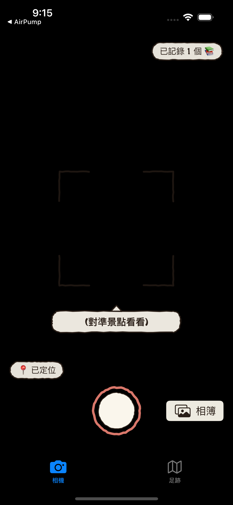
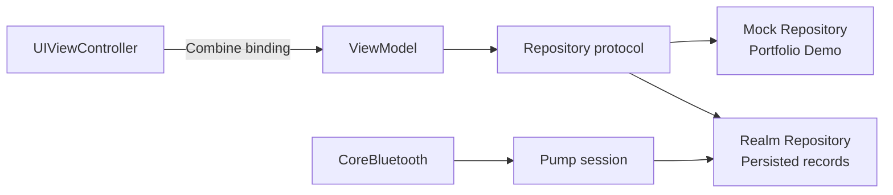

# AirPump iOS · Portfolio

[](https://github.com/cowton0627/AirPump-iOS-portfolio/actions/workflows/ios-ci.yml)

AirPump 是一款以 Swift 與 UIKit 開發的 iOS 應用，透過 CoreBluetooth 連接穿戴式擠乳器，提供裝置控制、擠乳紀錄與統計分析。

> Portfolio focus: BLE 狀態處理、UIKit 自訂 UI、MVVM + Repository 資料分層，以及無實體硬體的可重現展示流程。

## Demo

App 在全新安裝時預設開啟「示範模式」，不需實體擠乳器或預先建立資料，即可瀏覽今日紀錄、歷史與七日分析圖表。

<p align="center">
  
</p>

1. 在 Xcode 選擇 iOS Simulator 並執行。
2. 開啟「紀錄」分頁，切換今日、歷史與分析畫面。
3. 在「偏好設定」右上角切換示範與 Realm 真實資料。

| 今日紀錄 | 歷史紀錄 | 統計分析 |
| --- | --- | --- |
|  |  |  |

## 核心功能

- 搜尋、連接與斷開 BLE 週邊裝置
- 控制左右裝置的模式、強度與啟停狀態
- 顯示藍牙連線、電量、液高與操作狀態
- 以 Realm 儲存與觀察擠乳紀錄
- 整理單日、歷史與七日統計資料
- 使用 Core Graphics 繪製無第三方依賴的長條圖
- 內建無硬體 Demo Mode，並明確標示示範資料
- 為圖示導覽、影音播放與核心裝置控制提供 VoiceOver 名稱，動態同步 BLE 連線、播放、擠乳與紀錄分頁選取狀態，互動圖示至少保留 44×44pt 觸控範圍

## 技術與架構

- **Language / UI**: Swift, UIKit, Storyboard, Auto Layout
- **Reactive binding**: Combine
- **Bluetooth**: CoreBluetooth
- **Persistence**: RealmSwift
- **Architecture**: MVVM + Repository Pattern（紀錄與分析頁）
- **Drawing**: Core Graphics, `UIBezierPath`, `CAGradientLayer`, `CAShapeLayer`
- **Dependency management**: Swift Package Manager
- **Deployment target**: iOS 13.0+



ViewModel 只接收 Repository protocol，將 domain model 轉換成可直接顯示的 `ViewState`。Demo Mode 與 Realm 資料來源使用同一份 ViewModel 和 View，切換時不需重開 App。

## 實作重點

### 可替換的資料來源

`TodayRecordRepository`、`HistoryRecordRepository` 與 `DiscoveryStatsRepository` 定義資料契約。Mock Repository 提供可重現的作品集資料；Realm Repository 將實際操作紀錄轉成相同 domain model。

### UIKit 自訂視覺

- `BarChartView` 透過 `draw(_:)` 與 `UIBezierPath` 繪製七日長條圖。
- 操作頁使用 `CAGradientLayer` 與 `CAShapeLayer.mask` 繪製漸層弧線。
- 弧線路徑依 view bounds 產生，避免寫死特定螢幕尺寸。

### BLE 與記錄串接

`BLEConnectionManager` 負責掃描、連線、service / characteristic discovery、狀態更新與連線復原。操作結束後，裝置 characteristic 與經過時間會被轉換為 Realm record，再即時更新紀錄頁。

## 技術決策

較完整的選擇理由、放棄方案與已知取捨記錄在 [DECISIONS.md](DECISIONS.md)，包含：

- 為何在 iOS 13 UIKit 專案使用 Combine + Repository
- 為何不引入第三方 chart library
- 如何修正固定 frame 造成的弧線溢出
- 如何處理重複顯示的 custom alert

## 專案結構

```text
Breast Pump/
├── Controller/        # UIKit screens and record ViewModels
├── Model/             # BLE and persisted data models
├── Service/
│   ├── Bluetooth/    # CoreBluetooth connection lifecycle
│   └── Records/      # Realm-backed repositories and mapping
├── View/              # Storyboards, cells and custom views
├── Helper/            # Demo mode, timers and shared helpers
└── Supporting Files/  # GATT definitions and assets
Config/                  # Shared and local Apple signing settings
```

## 開發與執行

### 需求

- Xcode 16 或更新版本
- iOS 13.0+
- Swift Package Manager 可存取 GitHub 以取得 RealmSwift

```bash
git clone <repository-url>
cd AirPump-iOS-portfolio
open "Breast Pump.xcodeproj"
```

選擇 iOS Simulator 後按 `⌘R`。Simulator 不需要 Apple Developer Team。

### 測試

專案包含 `Breast PumpTests` target，涵蓋 Demo Mode 通知、Realm record mapping、左右裝置紀錄合併、session 分群、duration 解析與七日統計。版面回歸測試會以 393pt／320pt 寬度載入五個主分頁，檢查紀錄文字、KPI、圖表、操作控制與警示框未超出畫面，並驗證圖示控制具有 VoiceOver 名稱。

```bash
xcodebuild test \
  -project "Breast Pump.xcodeproj" \
  -scheme "Breast Pump" \
  -destination 'platform=iOS Simulator,name=iPhone 15' \
  CODE_SIGNING_ALLOWED=NO
```

### 實體裝置簽署

```bash
cp Config/Signing.local.xcconfig.example Config/Signing.local.xcconfig
# 編輯 Signing.local.xcconfig，填入自己的 Apple Developer Team ID
```

`Signing.local.xcconfig` 已被 Git 忽略，個人 Team ID 不會被提交到 repository。實際 BLE 操作需要相容的實體裝置與 iPhone。

## 已知限制

- Simulator 可展示紀錄與分析 UI，但無法取代實際 BLE 硬體驗證。
- 操作頁與 BLE manager 保留早期 UIKit 專案結構，後續可拆分為狀態機與指令編碼層。
- 討論區與影音區為展示中的非核心畫面，尚未接入後端內容。
- GitHub Actions 會在 push 至 `main` 與 pull request 時，以 macOS runner 建立 iOS Simulator、檢查公開簽署設定，並執行完整 unit-test suite。

## 作品集範圍

此 repository 是由早期實作整理的作品集版本，重點在呈現 iOS 工程設計、BLE 整合與後續重構過程。公開版本不包含公司名稱、商標、內部文件、私有伺服器資訊與個人 Apple Developer Team ID。

本 App 為工程作品集展示，不是醫療建議或經認證的醫療器材軟體。
